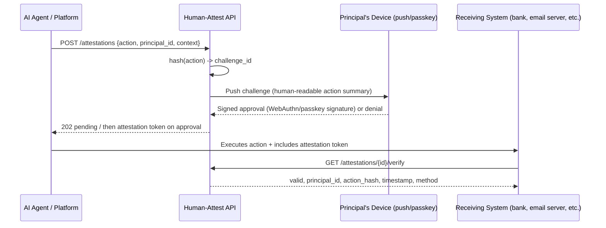

# Human-Attest: MVP Architecture Sketch

**Product framing:** "Stripe for proving a human authorized this agent action."
Not identity verification, not deepfake detection — a signed, non-replayable
attestation that a specific registered human approved a specific action, at
a specific moment.

---

## 1. Core concepts

| Concept | Meaning |
|---|---|
| **Principal** | The human who will authorize actions. Registers once. |
| **Agent / Caller** | The AI agent or platform that wants an action authorized. |
| **Action** | A described, hashable intent: "wire $25,000 to account X", "send email Y", "sign contract Z". |
| **Challenge** | A short-lived request pushed to the principal's device to approve/deny the action. |
| **Attestation** | A signed token proving: this principal, approved this exact action hash, at this time, via this challenge method. |

The whole system is a challenge–response protocol over a *hash of the
action*, not a general "are you human" check. This is the key design choice:
it makes replay attacks and deepfake video irrelevant, because the human is
approving *content*, not just presence.

**Critical design constraint:** the human-readable summary shown on the
principal's device MUST be rendered from the same structured payload that is
hashed and signed — never supplied as a separate free-text field by the
agent. Otherwise a compromised or malicious agent shows the human "pay $50
to Netflix" while the signed hash covers "$25,000 to attacker." The agent
submits the full structured action; *your service* canonicalizes it, hashes
it, and renders the summary from it. This is the single most important
correctness property of the system.

---

## 2. High-level flow



Two integration modes:
- **Synchronous** (agent blocks and polls until approved/denied) — good for chat-style agents.
- **Async/webhook** — for long-running agent workflows that can pause a task. The caller registers a `webhook_url` per platform (not per request); you POST `{attestation_id, status, token?}` on resolution, signed with an HMAC header so the caller can verify it came from you.

**Who verifies (the wedge, stated plainly):** the diagram shows a bank as
the verifier, but that's the *later* two-sided story. For v0, **the agent
platform itself is the verifier** — it gates its own action execution on a
valid attestation. That makes this a one-sided sale: you only need the agent
platform to integrate, no bank or counterparty cooperation required.
External verifiers (banks, email providers) come later, once attestation
tokens are flowing and there's something for them to check.

---

## 3. API surface (v0)

### Register a principal
```
POST /v1/principals
{
  "email": "...",
  "device_public_key": "...",       // from WebAuthn/passkey registration
  "backup_method": "sms" | "totp"
}
→ { "principal_id": "prin_abc123" }
```

### Request an attestation
```
POST /v1/attestations
{
  "principal_id": "prin_abc123",
  "action": {
    "type": "wire_transfer",
    "payload": {                        // full structured action — NOT a hash
      "amount": 2500000,                // cents
      "currency": "USD",
      "recipient_name": "Acme Corp",
      "account_last4": "4821"
    },
    "risk_tier": "high"                 // drives challenge strength
  },
  "requested_by": "agent_platform_id",
  "ttl_seconds": 900                    // humans take minutes, not seconds
}
→ { "attestation_id": "att_xyz789", "status": "pending",
    "payload_hash": "sha256:..." }      // computed server-side from canonicalized payload
```

The caller sends the **full structured payload**; the service canonicalizes
it (deterministic JSON), computes the hash, and renders the device-facing
summary from typed templates per `action.type`. The agent never controls
what the human sees. Per-`type` payload schemas are part of your API
contract (start with 3-4 types: `wire_transfer`, `send_email`,
`sign_document`, `generic` with mandatory display fields).

### Poll / webhook for result
```
GET /v1/attestations/{id}
→ {
    "status": "approved" | "denied" | "expired",
    "token": "eyJ...",      // signed attestation (JWS/ES256 for v0), only if approved
    "method": "passkey" | "push+liveness",
    "approved_at": "2026-07-26T18:03:11Z"
  }
```

### Verify an attestation (called by the receiving system, e.g. the bank)
```
POST /v1/attestations/verify
{ "token": "eyJ..." }
→ {
    "valid": true,
    "principal_id": "prin_abc123",
    "action_hash": "sha256:...",
    "approved_at": "...",
    "method": "passkey"
  }
```

The `token` is a signed, short-lived credential — for v0, a JWS signed with
your service key (ES256); revisit COSE/CBOR for WebAuthn-native interop
later — binding **principal + action hash + timestamp**. Anyone can verify
it offline against your public key without calling back to you, which
matters for trust ("you don't have to trust our servers at query time, just
our signing key").

---

## 4. Threat model — what this defends against, and what it doesn't

Be explicit about this; it's the first thing a security-literate buyer or
investor will probe, and honest limits build more credibility than
overclaiming.

**Defended:**

| Attack | Defense |
|---|---|
| Deepfake video/voice call convinces a human to approve | The human approves a rendered summary of the *actual* payload on their own device — social pressure on a call can't change what the signed hash covers. (It reduces, not eliminates, social engineering: a pressured human can still tap approve — Tier 4 multi-party exists for exactly this.) |
| Rogue/compromised agent executes an unauthorized action | Action requires a fresh attestation; no valid token, no execution (when the platform gates on it) |
| Agent shows the human one thing, executes another | Summary is rendered server-side from the canonicalized signed payload — the agent never supplies display text |
| Replay of an old approval | The issued token binds to a specific payload hash + timestamp + short expiry, and verifiers check all three — but that alone was not sufficient, and shouldn't be read as the whole story. The human's WebAuthn signature is bound to one specific attestation instance, not merely to the action content: two independently-created attestations can legitimately carry byte-for-byte identical payload content (and therefore an identical action hash), so a signature captured approving one is not valid input for minting a fresh token against the other. That distinction matters because the attack this defends against isn't replaying a stale *token* — expiry would catch that — it's replaying a captured *signature* to mint a brand-new, validly-timestamped token against a different attestation, which a token-level expiry check never sees coming. |
| Stolen attestation token reused for a different action | Token is bound to the action hash; different action → hash mismatch → invalid |
| Your API server compromised (token forgery) | Tokens are verifiable offline against your published signing key; key lives in an HSM/KMS, not on app servers |

**NOT defended (say so honestly):**

- **Compromised principal device.** If an attacker fully controls the
  principal's phone (malware with screen/input control), every tier that
  terminates on that device collapses. Mitigations, not fixes: hardware
  security keys as a device-independent Tier, multi-party approval (attacker
  must compromise N devices), and anomaly heuristics (velocity, geography).
  This is the same residual risk every 2FA system carries — be upfront.
- **A willing, deceived human.** If social engineering convinces the
  principal the action is legitimate, they will approve it with full
  understanding of what they're approving. Clear payload rendering and
  multi-party review shrink this; nothing eliminates it.
- **Malicious agent platform.** If the platform integrating you is itself
  the attacker, it can skip calling `/verify`. Value here requires either
  the platform being honest-but-vulnerable (the common case) or an external
  verifier (the later, two-sided phase).

## 5. Challenge strength tiers (this is your actual product differentiation)

| Tier | Mechanism | Use case |
|---|---|---|
| **Tier 1 — Passkey** | WebAuthn signature from a registered device/hardware key | Routine actions, low dollar amount |
| **Tier 2 — Passkey + push context** | Same, but the human sees the actual action summary before signing (not a blind tap) | Medium-risk actions |
| **Tier 3 — Liveness check** | Short live video/voice challenge with a random spoken phrase or gesture, checked against enrolled biometric + anti-replay (challenge phrase changes every time) | High-risk / high-dollar, or when device isn't available |
| **Tier 4 — Multi-party** | Requires N-of-M approvers (e.g. CFO + a second signer) | Very high-risk, matches the $25M fraud scenario directly |

Start with **Tier 1 + Tier 4** for MVP — pure cryptographic signing, no biometrics
needed. That's buildable in weeks with existing WebAuthn libraries and gets
you a real, defensible product without touching the deepfake-detection
arms race at all. Add Tier 3 later as a premium/high-risk feature, likely
via a liveness-detection vendor (don't build this yourself initially).

---

## 6. What you build vs. buy for MVP

| Component | Build or buy |
|---|---|
| WebAuthn/passkey registration + challenge signing | Build — this is your core IP, but standard libraries exist (`@simplewebauthn/server`, etc.) |
| Push notification delivery | Buy (Firebase Cloud Messaging / APNs, or Twilio for SMS fallback) |
| Liveness/anti-deepfake detection (Tier 3) | Buy initially (vendor SDK) — revisit build vs. buy once you have revenue |
| Attestation token signing/verification | Build — small, but it's the trust primitive, keep it in-house |
| Audit log / compliance trail | Build — banks/fintechs will require this for their own compliance |

---

## 7. Data model sketch

```
principals(id, email, created_at, status)
devices(id, principal_id, public_key, method, enrolled_at)
actions(id, requested_by, type, payload_hash, risk_tier, created_at)
attestations(id, action_id, principal_id, status, method, token, approved_at, expires_at)
audit_log(id, attestation_id, event, actor, timestamp)
```

Keep `payload_hash` as the only thing you store about the *content* of the
action — you don't want to be a data store for wire transfer details or
email contents. You're a trust layer, not a record-of-truth for the
underlying business data. This also reduces your liability/compliance surface
significantly.

---

## 8. MVP scope cut (buildable solo in ~4-6 weeks)

1. Principal registration + passkey enrollment (web page + API)
2. `POST /attestations` + push notification + approve/deny UI (mobile web is fine, no native app needed for v0)
3. Signed token issuance + `/verify` endpoint
4. A single reference integration: a demo "agent" (even a simple script) that calls your API before "sending a wire" — this becomes your demo for design partners
5. Basic audit log / dashboard so a design partner can see attestation history

Explicitly **cut for v0**: liveness detection, multi-party approval, SDKs
for every language (start with a REST API + one client library), any mobile
native app (web push / passkeys work in-browser).

---

## 9. Pricing sketch (v0 hypothesis)

Usage-based, Twilio-style: **per-attestation pricing tiered by challenge
strength** — e.g. $0.05 for Tier 1 passkey, $0.50+ for Tier 3 liveness,
custom for Tier 4 multi-party — plus a platform fee per registered
principal/month for the audit trail and dashboard. The buyer is the agent
platform (B2B); principals never pay. Validate willingness-to-pay in
design-partner conversations before committing — the honest answer is this
is a hypothesis, but walking in without *any* pricing model reads as
unserious.

## 10. Open technical questions to resolve early

- **Key custody**: do principals hold their own private key (self-custodial, more trust but harder onboarding) or do you manage key material in an HSM on their behalf (easier onboarding, but you become a juicier attack target and a bigger liability)?
- **Recovery**: what happens when someone loses their device? This is the classic passkey UX problem and you'll need a real answer before any serious customer trusts you.
- **Interop**: do you go proprietary token format first for speed, or invest early in aligning with existing standards (WebAuthn, FIDO2, or emerging agent-authorization proposals) so you're not an island later?
